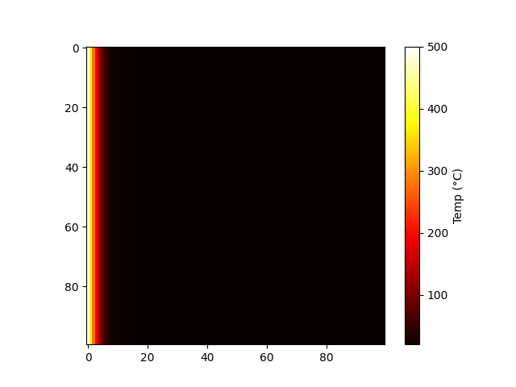

# 2D Heat Diffusion Simulation in Bi-Materials

## Project Overview

This project simulates the transient heat transfer through a composite material consisting of **Copper** and **Steel**. Using the **Finite Difference Method (FDM)** and **NumPy**, the simulation models how heat propagates from a constant source on one end across a material interface into an insulated boundary.

This was developed to demonstrate proficiency in **Numerical Methods**, **Python Vectorization**, and **Computational Materials Science**.

## Physical Model

The simulation solves the 2D Heat Equation:

Where ** (Thermal Diffusivity)** is defined as:

### Material Properties Used:

| Property | Copper (Left) | Steel (Right) |
| --- | --- | --- |
| **Thermal Diffusivity ()** | 0.116 | 0.013 |
| **Role** | Heat Conductor | Thermal Barrier |

## Boundary Conditions

To accurately model a real-world physical system, three types of boundary conditions were implemented:

1. **Dirichlet Boundary (Left Edge):** Constant heat source maintained at .
2. **Neumann Boundary (Right Edge):** Perfect insulation (zero heat flux).
3. **Insulated Edges (Top/Bottom):** Prevented vertical heat loss, ensuring a closed system.

## Implementation Details

* **Vectorized Slicing:** Instead of using nested `for` loops, the Laplacian operator was calculated using NumPy slices (`1:-1`). This approach is  faster and reflects high-performance computing standards.
* **Stability:** The time-stepping follows the Stability Criterion for explicit methods, ensuring .

## How to Run

1. Create a virtual environment: `python3 -m venv env`
2. Activate environment: `source env/bin/activate`
3. Install dependencies: `pip install numpy matplotlib`
4. Run the simulation: `python3 simulate_heat.py`

## Results

The simulation clearly illustrates the "bottleneck" effect at the material interface. While heat moves rapidly through the Copper section, the low diffusivity of the Steel section creates a significant thermal gradient, demonstrating the effectiveness of steel as a thermal insulator in composite structures.
The resulting heatmap illustrates a sharp change in the temperature gradient at the material interface ().

1. **Copper Zone:** Shows a smooth, deep penetration of heat.
2. **Steel Zone:** Shows a rapid drop in temperature, confirming its role as an insulator.
3. **Steady State:** Over time, the system approaches a linear temperature profile, modified by the differing thermal resistances of the two materials.

## 5. How to Run the Simulation

1. **Environment:** Python 3.x with a Virtual Environment (`venv`).
2. **Dependencies:** `pip install numpy matplotlib`.
3. **Execution:** Run the script "python3 simulate_heat.py" to generate the `Heat_Diffusion_BiMaterial.pdf` report and the on-screen heatmap.

---